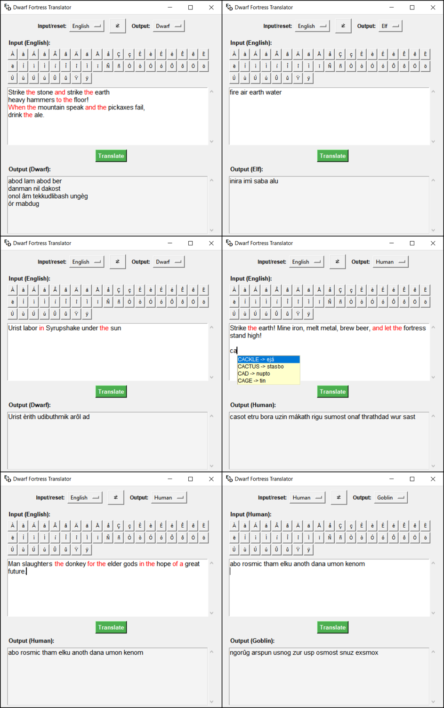

# DF Translator

A small dictionary-based translation tool for **Dwarf Fortress** languages.

Ever wanted your **songs**, **artifacts**, or **legendary historical figures** to actually sound like they came from the civilization they belong to? **DF Translator** allows you to translate text between English and the languages of Dwarf Fortress or even between the fantasy languages themselves.



## Features

* Translate between **English** and Dwarf Fortress languages:
  * Dwarven
  * Elven
  * Goblin
  * Human

* Translate between fantasy languages directly.
* Uses the **original in-game dictionaries**, preserving Dwarf Fortress' own limitations and style.
* Correctly handles compound words used in:
  * Surnames
  * Site names
  * Other generated names
    
* Supports:
  * English verb conjugations
  * Plural forms
  * Autocomplete for special characters and uncommon words

## About the Translation System

DF Translator intentionally uses the same limited vocabulary available in Dwarf Fortress. This means:
* Not every English word has a translation.
* Punctuation is not supported.
* Missing words are highlighted and removed from the output.

This limitation is part of the charm: creating meaningful text, songs, and poems becomes a creative challenge using the available vocabulary.

## Usage

The application is designed to be simple:
1. Enter your text.
2. Select the source and target languages.
3. Translate.

No configuration or complicated setup is required.

The special character shortcuts allow you to quickly write words that start with uncommon characters without having to copy them manually. Press the desired character and then press **Tab** to display available words.

## Examples

### Song / Poem Translation

English:

```
Champions are rewarded by Fortune!
```

Dwarf Fortress-style translation:

```
akur akir akam
```

### Name Translation

English:

```
Poisoncrazy
```

Goblin:

```
Stozukagus
```

## Installation

DF Translator is distributed as a standalone Windows executable.

Simply download the latest release and run the `.exe` file.

## Platform Support

Currently supported:
Windows

Other platforms are not supported at this time.

## Feedback and Bug Reports

DF Translator is actively tested, but bugs may still exist.

If you find an issue, have a suggestion, or want to provide constructive feedback, please open an issue in this repository.

## Final remark

Enjoy creating songs, poems, names, and stories in the languages of Dwarf Fortress!
